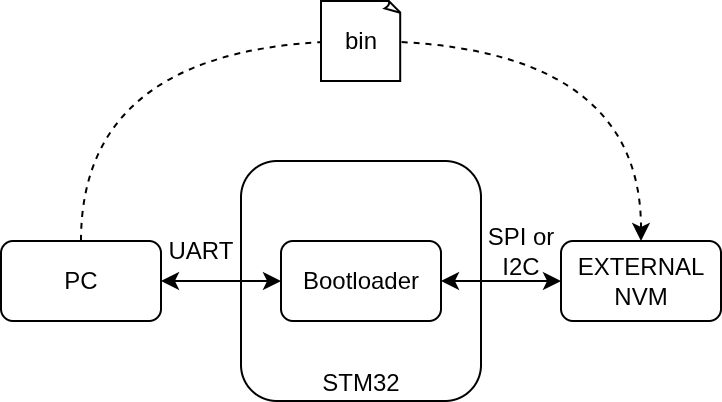

# About
A bootloader for STM32 model: STM32L412KBU6

End goal: Create a bootloader to write an external NVM



``` mermaid

```

## Book example

### Bootup

Follow the repo book example: Chapter 4 - bootup, adapte to our MCU.
It sets a part of the ISR vector table found on Cortex-M4 MCUs.

``` bash
cd book/bootup
make clean && make
```
